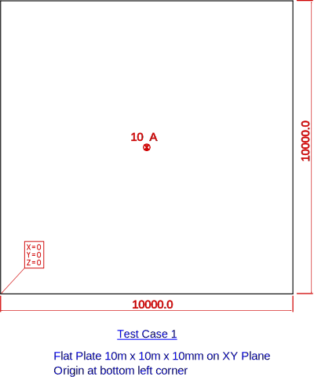
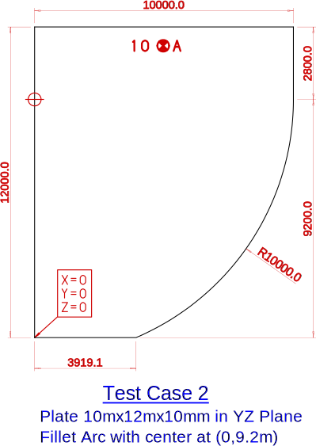
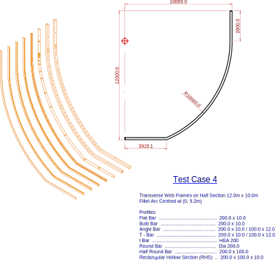
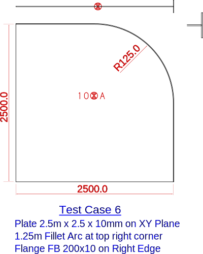

# TestCases
This is part of the [OpenHCM][OpenHCM] [data format][dataformat].
The set of test cases are here to provide background reference when implementing OpenHCM software.

The test cases include:
-  **Flat Plate** 

-  **Flat Plate with rounded corner**

-  **Plate and 8 Stiffener profiles**

-  **Transverse Web Frames on Half Section**

-  **Plate with face plate**

-  **Plate rounded corner with face plate**

-  **Plate with Inner Hole and face plate**

-  **Shell Plate**

[OpenHCM]:<http://github.com/OpenHCMStandard/>
[dataformat]: <https://openhcmstandard.github.io/Data-Format/>
